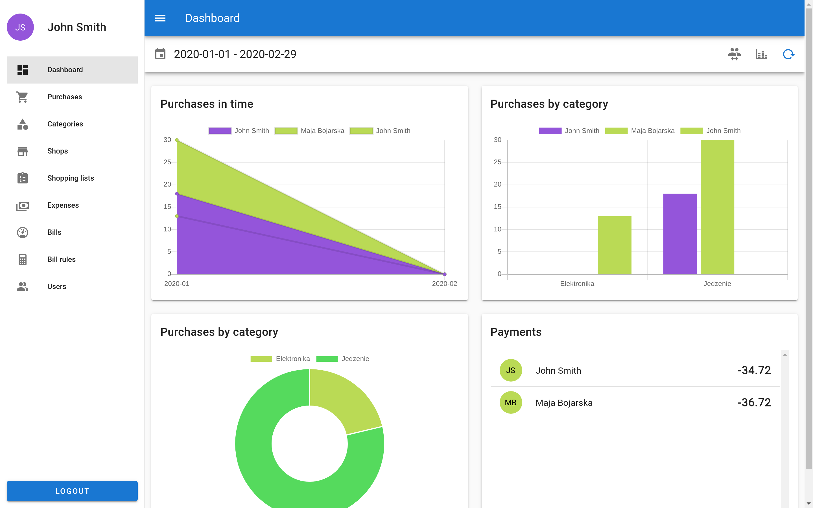

# About
hhapp is a progressive web app made to simplify the management of household expenses. Made for a university project.  

### Main features:
- Keeping information about shop purchases, house bills and other expenses. 
- Automated splitting of bills between all the householders. Custom bill calculation rules can be created. 
- Keeping track of due payments for each user.
- Purchase summaries by time and shopping category.
- Shopping lists, which can be converted directly into purchases.
- More (if you implement that :smile: )

# Tech stack

## Backend
- MariaDB
- NGINX
- NodeJS
- NestJS framework
- TypeORM framework
- Docker

## Frontend
- TypeScript
- VueJS framework
- Vuetify framework (Material Design)

# More details

A detailed description of the project and setup, can be found in [the documentation](docs/out/Bazy_Danych_2.pdf) and README files.

# Authors

- Damian Koper (lead)
- Maja Bojarska